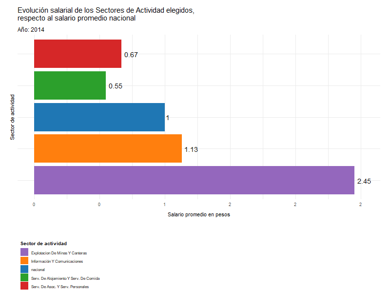

El presente documento busca describir los procesamientos realizados con el objetivo de cumplir la consigna 1 del Trabajo Integrador I, de la Diplomatura en Ciencias Sociales Computacionales y Humanidades Digitales, de la UNSAM.

Para el desarrollo de esta última consigna hemos utilizado la base obtenida como resultado en la consigna 2, la cual ha sido construida a partir de datos relevados por el [Ministerio de Desarrollo Productivo de la República Argentina](https://datos.produccion.gob.ar/dataset/salarios-por-departamento-partido-y-sector-de-actividad).

<br>

### Consigna 3
_______________________________________________________________________________________
**Estime el salario promedio del total del país a lo largo de los años disponibles en la base. Luego, elija cuatro sectores de actividad (los cuales se distinguen por la letra) o grupos de sectores y visualice la evolución de sus salarios expresados en relación al promedio nacional. Por ejemplo, si para un año X, el salario promedio nacional es 100 y el de la rama petrolera es 150, el dato para la última rama debe expresarse como 1,5**

<br>

##### Cargamos las librerías e importamos la bases

Primero traemos la base "mean_sect_ano" que se ha generado en la consigna 2. La misma contiene cuatro columnas o variables: "year", "letra", "letra_desc" y "mean_sector". Permite conocer entonces el promedio salarial de cada sector por cada año. Para mayor legibilidad, renombramos "mean_sector", le ponemos "promedio sector". La base también cambia de nombre y ahora se llama "mean_sect_ej3".

```{r, warning=FALSE, message=FALSE}
library(tidyverse)
library(ggplot2)
library(gganimate)
library(gifski)

mean_sect_ano <- read.csv("BASES-Y-VIZ/PRESENTACION_FINAL/mean_sect_ano.csv", header = TRUE)
mean_sect_ej3<- mean_sect_ano %>% 
  rename(promediosector= mean_sector) %>% 
  glimpse()
```

<br>

##### Elección de sectores

Nos interesa que los sectores a visualizar tengan dispersión entre si en lo que respecta a sus salarios promedio, por ello decidimos que pertenecieran a diferentes cuartiles, al menos para el año 2023. Por esa razón fue necesario conocer los cuartiles:

```{r, warning=FALSE, message=FALSE, results= 'hide'}

cuartiles_max_2023<- mean_sect_ej3 %>% 
  filter(year==2023) %>%
  summary(promediosector)

print(cuartiles_max_2023)

cuartil1<- mean_sect_ej3%>% 
  filter(year==2023,
         promediosector<=240566) %>% 
  arrange(promediosector)

cuartil2<- mean_sect_ej3 %>% 
  filter(year==2023,
         promediosector>240566 & promediosector<=312783) %>% 
  arrange(promediosector)
   
cuartil3<-mean_sect_ej3 %>% 
  filter(year==2023,
         promediosector> 312783 & promediosector<=430231) %>% 
  arrange(promediosector)

cuartil4<-mean_sect_ej3 %>% 
  filter(year==2023,
         promediosector> 430231) %>% 
  arrange(promediosector) 
```

<br>

##### Consolidación de nueva base 

Creamos una nueva base "salario_x_year" con el promedio salarial nacional por año. Para ello hicimos una agregación de todos los sectores cada año, y a la columna "letra_desc" (que antes tenía la descripción de los sectores) le asignamos el valor "nacional". 

```{r,warning=FALSE, message=FALSE}
salario_x_year <- mean_sect_ej3 %>%
  select(letra_desc, year, promediosector) %>%
  group_by(year) %>% 
  summarize(promediosector = mean(promediosector, na.rm = TRUE)) %>% 
  mutate(letra_desc = "nacional") %>% 
  glimpse()
```

Luego creamos una base "evoluc_salarios" que combina el salario promedio por año de los cuatro sectores elegidos así como el salario promedio nacional por año. El salario nacional es entonces tratado como un sector más para poder observar las desviaciones de los sectores elegidos de un promedio general.

```{r,warning=FALSE, message=FALSE}
evoluc_salarios<- mean_sect_ej3 %>% 
  filter(letra_desc == "Serv. De Alojamiento Y Serv. De Comida" |
           letra_desc == "Serv. De Asoc. Y Serv. Personales"|
           letra_desc == "Información Y Comunicaciones"|
           letra_desc =="Explotacion De Minas Y Canteras") %>% 
  bind_rows(salario_x_year) %>% 
  glimpse()
```

Con el objetivo de cumplir con la propuesta de la consigna, ahora procederemos a calcular los diferentes salarios promedios de cada sector, para cada año, como una proporción del promedio nacional para el 2014, primer año de la serie.

```{r}
mean_nac_ini <- evoluc_salarios %>% 
  filter(year == min(year),
         letra_desc == "nacional") %>% 
  summarise (promediosector)

evoluc_salarios <- evoluc_salarios %>% 
  mutate(evo_prop = round(promediosector/mean_nac_ini$promediosector, 2))
```

<br>

##### Gráfico animado

Hacemos un gráfico de barras animado que muestra la progresión entre el 2014 y el 2023 de los salarios de los sectores escogidos, mostrados como una proporción respecto del promedio nacional al inicio de la serie. 

```{r warning=FALSE, message=FALSE}
graf_comp <- ggplot(evoluc_salarios) +
  geom_col(aes(x = evo_prop, y = letra_desc, fill = letra_desc)) +
  geom_text(aes(x = evo_prop, y = letra_desc, label = evo_prop), hjust = -0.2, size = 2) +
  scale_fill_manual(values = c(
    "nacional" = "#D3D3D3", 
    "Información Y Comunicaciones" = "#FFB3BA", 
    "Serv. De Alojamiento Y Serv. De Comida" = "#FFDFBA", 
    "Serv. De Asoc. Y Serv. Personales" = "#FFFFBA", 
    "Explotacion De Minas Y Canteras" = "#BAFFC9"
  )) +
  theme_minimal() +
  labs(
    title = "Evolución salarial de los Sectores de Actividad elegidos,
    respecto al salario promedio nacional para 2014",
    subtitle = "Año: {frame_time}",
    fill = "Sector de actividad",
    x = "Salario promedio en pesos",
    y = "Sector de actividad"
  ) +
  scale_x_continuous(labels = scales::number_format(accuracy = 1)) +
  theme(
    plot.title = element_text(size = 15, face = "bold", family = "sans"),
    plot.subtitle = element_text(size = 12, family = "sans"),
    legend.title = element_text(size = 10,face = "bold", family = "sans"),
    legend.text = element_text(size = 8, family = "sans"),
    axis.title.x = element_text(size = 11, family = "sans", margin = margin(t = 10),hjust = 0.5),
    axis.text.y = element_blank(),
    legend.position = "bottom",
    legend.direction = "vertical",
    legend.box = "vertical",
    legend.justification = c(0, 0),            
    legend.box.margin = margin(t = 20),
    plot.margin = margin(t = 30, r = 20, b = 10, l = 20),
  )

anim <- graf_comp +
  transition_time(year) +
  ease_aes('linear')

#anim_save("graf_comp.gif")

```
¡Acá el resultado!


<br>

##### Gráfico extra: brecha salarial por año

Hacemos un nuevo gráfico para poner el foco no sólo en la variación salarial sino en la variación de la brecha entre los sectores. Para ello, primero hacemos un nuevo procesamiento de datos y calculamos la diferencia entre el sector con mayor salario y el sector con menor salario en terminos absolutos así como en términos porcentuales. El resultado es la base "brecha_salarial_porcentaje"


```{r,warning=FALSE, message=FALSE}
sal_year_brecha<- salario_x_year %>% 
  select(year, promediosector) %>% 
  rename(promedio_nacional= promediosector)


brecha_salarial_porcentaje <- mean_sect_ej3 %>%
  left_join(sal_year_brecha) %>%
  group_by(year) %>% 
  summarize(
    Salario_Maximo = max(promediosector, na.rm = TRUE),  
    Salario_Minimo = min(promediosector, na.rm = TRUE), 
    Brecha_Salarial = Salario_Maximo - Salario_Minimo,   
    Brecha_Sal_porc = round((Salario_Maximo / Salario_Minimo) * 100, 2)) %>% 
    glimpse()
```

Ahora sí, un gráfico de barras para representar la brecha:

```{r,warning=FALSE, message=FALSE,}
plot<-ggplot(brecha_salarial_porcentaje, aes(x = year, y = Brecha_Sal_porc, fill = as.factor(year))) +
  geom_col(position = "stack", width = 0.5) +
  geom_line(linewidth = 1.0, aes(group = 1)) +
  labs(title="Brecha Salarial",
    y = "Diferencia porcentual entre salarios mínimos y máximos",
       x = "Año",
       fill = "Año") +
  scale_x_continuous(breaks = c(2014:2023)) +
  scale_y_continuous(limits = c(0, 1000)) +
  theme_minimal()+
  theme(legend.position = "none",  plot.title = element_text(size = 20, face = "bold", family = "sans"),plot.margin = margin(t = 20, r = 20, b = 10, l = 20))

#ggsave("brecha_salarial_plot.png", plot = plot, width = 10, height = 6, dpi = 300)
```


